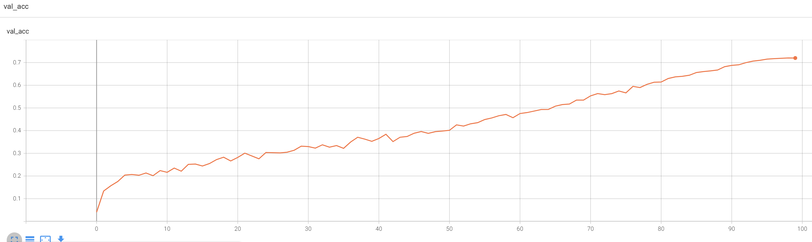

# Bilinear Prompt Tuning: A PyTorch Implementation


<div style="text-align:center"></div>


This is a PyTorch implementation of the paper [Attention to the Burstiness in Visual Prompt Tuning!](https://arxiv.org/abs/2506.22908).

[[`arXiv`](https://arxiv.org/abs/2506.22908)] [[`ICCV'25 paper`](https://arxiv.org/abs/2506.22908)]


```BibTeX
@InProceedings{wang2025attention,
  author  = {Yuzhu Wang and Manni Duan and Shu Kong},
  title   = {Attention to the Burstiness in Visual Prompt Tuning!},
  booktitle = {International Conference on Computer Vision (ICCV)},
  year    = {2025},
}
```

* The implementation mainly consists of three parts: `image data preprocessing`, `loading of pre-trained models`, and `training scripts`.

* This repository includes some demos to help reproduce. See [demo_BPT_eval.ipynb](deom_BPT_eval.ipynb), [demo_BPT_det.ipynb](demo_BPT_det.ipynb) and [demo_BPT_dis.ipynb](demo_BPT_dis.ipynb) for details.

* This repository is based on PyTorch==1.10.0 and [timm==0.6.0](https://github.com/rwightman/pytorch-image-models).


### 1. Datasets and Pre-trained Models

- Dataset

    - See Table 6 in the appendix for dataset details. 

    - Fine-Grained Visual Classification tasks (FGVC). The datasets can be downloaded following the official links.
        - [CUB-200-2011](http://www.vision.caltech.edu/visipedia/CUB-200-2011.html)

        - [NABirds](http://info.allaboutbirds.org/nabirds/)

        - [Oxford Flowers](https://www.robots.ox.ac.uk/~vgg/data/flowers/)

        - [Stanford Dogs](http://vision.stanford.edu/aditya86/ImageNetDogs/main.html)

        - [Stanford Cars](https://ai.stanford.edu/~jkrause/cars/car_dataset.html)
    

    - The file folder `./Dataset` implements image loading and preprocessing.

- Pre-trained Models

    - The following table provides the pre-trained checkpoints used in the paper.

        <table><tbody>
        <!-- START TABLE -->
        <!-- TABLE HEADER -->
        <th valign="bottom">Pre-trained Objective</th>
        <th valign="bottom">Link</th>
        <!-- TABLE BODY -->
        </tr>
        <td align="center">MAE, ViT-Base/Large/Huge</td>
        <td align="center"><a href="https://dl.fbaipublicfiles.com/mae/pretrain/mae_pretrain_vit_base.pth">download</a></td>
        </tr>
        <td align="center">MAE, ViT-2B</td>
        <td align="center"><a href="https://github.com/facebookresearch/maws">download</a></td>
        </tr>
        <td align="center">MoCo v3</td>
        <td align="center"><a href="https://dl.fbaipublicfiles.com/moco-v3/vit-b-300ep/linear-vit-b-300ep.pth.tar">download</a></td>
        </tr>
        </tbody></table>
    
    - We load ImageNet-21K supervised pre-trained model weights by [timm](https://github.com/rwightman/pytorch-image-models).

### 2. Implementation of BPT

Take MAE pre-training as an example. 

- BPT-fwhiten or BPT-twhiten
    - These two methods are implemented in files `./Models/MAE_bpt_shallow.py` and `./Models/MAE_bpt_deep.py`;

    - For BPT-fwhiten or BPT-twhiten, we need to set `whitening=True` and prepare the pre-trained weights of `Wq, Wk` and patch embeddings `X`. See Line 33-57 of `./Models/MAE_bpt_shallow.py` for detials;


- BPT-bilinear, we set `whitening=False`;


### 3. Training scripts

### 3.1 BPT-bilinear with MAE pre-trained ViT-B:
  ```bash
  # for instance, prompt tuning on CUB-200 dataset via shallow variant.
  torchrun --nproc_per_node=4 \
           train_MAE.py \
           --model_name MAE_bpt_vit_b \
           --finetune ${MAE_Pretain_ckpt} \
           --drop_path 0.0 \
           --dataset CUB200 \
           --tuning_type "prompt" \
           --num_prompts 100 \
           --channels 75 \
           --epochs 100 \
           --batch_size 32 \
           --weight_decay 5e-3 \
           --wd_head 0.5 \
           --lr 5e-2 \
           --min_lr 1e-8 \
           --warmup_epochs 10 \
           --model_ema \
           --save_dir ${SAVE_PATH}
  ```
  - `num_prompts` is 100 for shallow, and 50 for deep.

  - For deep variant, set model_name as `MAE_bpt_deep_vit_b` and turn on `prompt_deep`.

  - The training recipes for other tasks are similar, please refer to `./script/MAE`.


### 3.2 BPT with MoCo and Supervised Pre-training

  ```bash
  # for instance, deep variant on dogs-120.
  torchrun --nproc_per_node=4 \
           train_MoCo.py \
           --model_name bpt_deep_vit_b \
           --drop_path 0.0 \
           --dataset DOG120 \
           --tuning_type "prompt" \
           --num_prompts 50 \
           --channels 50 \
           --prompt_deep \
           --epochs 100 \
           --batch_size 32 \
           --weight_decay 2e-3 \
           --wd_head 0.1 \
           --lr 5e-2 \
           --min_lr 1e-8 \
           --warmup_epochs 10 \
           --model_ema \
           --save_dir ${SAVE_PATH}
  ```

  - The script is similar to MAE pre-training.

  - Please refer to `./script/MoCo` and `./script/sup` for other task recipes.


### 4. Accuracy curves

- We provide some test-accuracy curves for reference. (BPT-bilinear-shallow with MAE pre-trained ViT-B backbone.)

  - CUB-200
  <div style="text-align:center"></div>

  - NABirds-555
  <div style="text-align:center"></div>

  - CAR-196
  <div style="text-align:center"></div>

  - COCO, Cascade Mask R-CNN
  <div style="text-align:center"></div>

  
